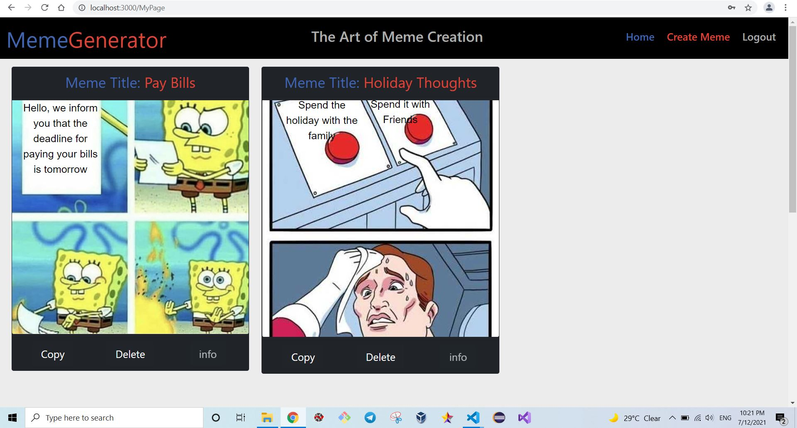
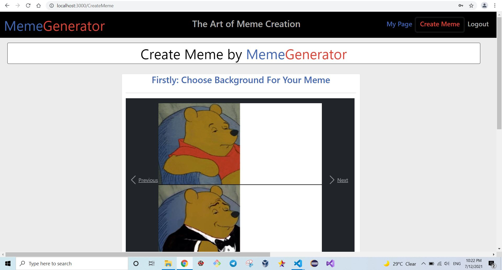
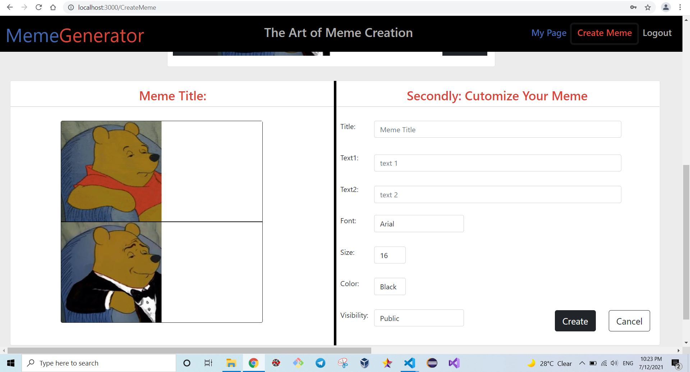
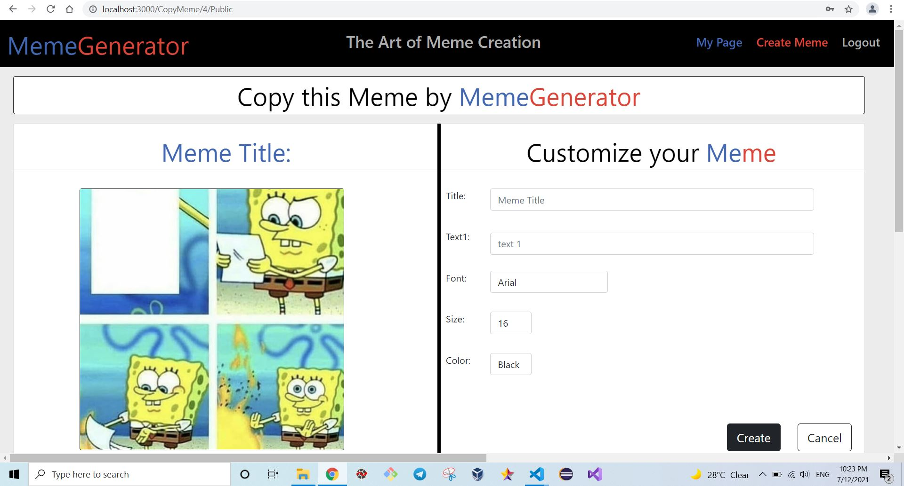
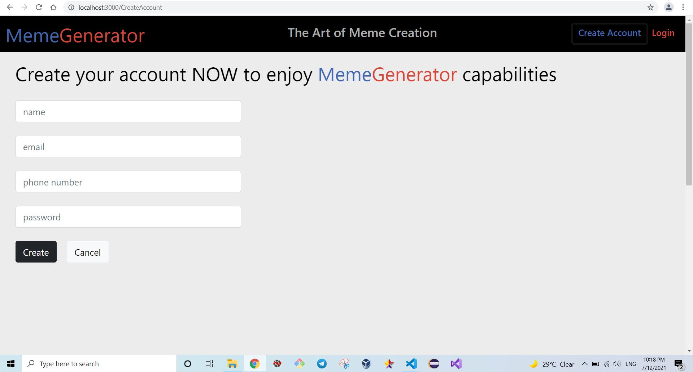
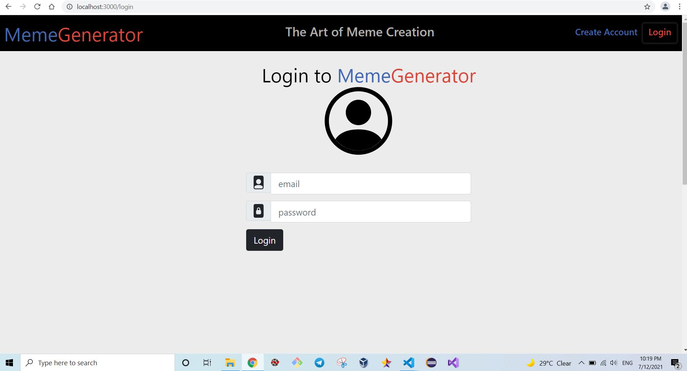

# Exam #2 : "MemeGenerator"
## Student: s289417 Alashram Amr

## React Client Application Routes

- Route '/Home': The main page of the website. It shows All public Memes if not logged in but all memes if logged in.
- Route '/MyPage': The page of the user (when logged in), where each user can review their own Memes only.
- Route '/CreateMeme': It allows user to create a Meme by choosing background image, write sentences, and customize font format. (Only when logged in)
- Route '/CopyMeme/: imgID/:visibility' : It allows user to copy an existing Meme, where only img and visibility options are inherited. However, user can customicze font format. imgID and visibility is know by the page through the url params.
- Route '/login': It allows user to login to his/her account using its email and password.
- Route '/CreateAccount': It allows to add new user account by entering user like: username, email, password.

## API Server

* POST `/sessions`
  - request body: an object representing a user (Content-Type: `application/json`)

  ```json
  {
      "username": "Luca.email@gmail.com",
      "passowrd": "password"
  }
  ```
  - response body:  user info (Content-Type: `application/json`)
  
  ```json
  {
    "id": 1,
    "name": "Luca",
    "email": "Luca.email@gmail.com",
    "hashpasswd": "$2b$10$nHLAdGNSlomYH61JO6clH.kZeY7LPlNeuDY1yThhzoEipjJI3YYdW"
  }
  ```
  - Error responses: `401 (Unauthenticated User)`

* DELETE `/sessions/current`
  - Request body: None
  - Response body: None

* GET `/sessions/current`
  -  request body: None
  -  response body: user info (Content-Type: `application/json`)
  
  ```json
  {
    "id": 1,
    "name": "Luca",
    "email": "Luca.email@gmail.com",
    "hashpasswd": "$2b$10$nHLAdGNSlomYH61JO6clH.kZeY7LPlNeuDY1yThhzoEipjJI3YYdW",
    "phoneNumber": "1891316452"
  }
  ```
  -  Error responses: `401 (Unauthenticated User)`

* GET `/Home/All`
  - Request body: None
  - Response body: an array of objects describing the Memes (Content-Type: `application/json`)

  ```json
  
  {
    "key": 1,
    "user": 'Luca',
    "title": 'Vacation Thoughts',
    "imgID": 0,
    "text1": 'When you are in a vacation',
    "text2": 'When you remember all the waiting tasks after the vacation',
    "fontFamily": 'Arial',
    "fontSize": 24,
    "fontColor": 'Red',
    "visibility": 'public'
  },
  {
    "key": 2,
    "user": 'Luca',
    "title": 'Vacation Thoughts',
    "imgID": 1,
    "text1": 'A good boy that love you',
    "text2": 'A bad boy that do not like you',
    "fontFamily": 'Arial',
    "fontSize": 32,
    "fontColor": 'Red',
    "visibility": 'public'
  },

  ```
  - Error responses: `500 (database error)`

* GET '/Home/Public'
  - Request body: None
  - Response body: an array of objects describing the Memes but only where visibility is public (Content-Type: `application/json`)

  ```json

  {
    "key": 1,
    "user": 'Luca',
    "title": 'Vacation Thoughts',
    "imgID": 0,
    "text1": 'When you are in a vacation',
    "text2": 'When you remember all the waiting tasks after the vacation',
    "fontFamily": 'Arial',
    "fontSize": 24,
    "fontColor": 'Red',
    "visibility": 'public'
  },
  {
    "key": 2,
    "user": 'Luca',
    "title": 'Vacation Thoughts',
    "imgID": 1,
    "text1": 'A good boy that love you',
    "text2": 'A bad boy that do not like you',
    "fontFamily": 'Arial',
    "fontSize": 32,
    "fontColor": 'Yellow',
    "visibility": 'public'
  }
  ```
  - Error responses: `500 (database error)`

  * GET '/MyPage/:user'
  - Request body: user
  - Response body: an array of objects describing the Memes but only which belongs to the logged in user (Content-Type: `application/json`)

  ```json
  {
    "key": 1,
    "user": 'Luca',
    "title": 'Vacation Thoughts',
    "imgID": 0,
    "text1": 'When you are in a vacation',
    "text2": 'When you remember all the waiting tasks after the vacation',
    "fontFamily": 'Arial',
    "fontSize": 24,
    "fontColor": 'Red',
    "visibility": 'public'
  },
  {
    "key": 2,
    "user": 'Luca',
    "title": 'Vacation Thoughts',
    "imgID": 1,
    "text1": 'A good boy that love you',
    "text2": 'A bad boy that do not like you',
    "fontFamily": 'Arial',
    "fontSize": 32,
    "fontColor": 'Yellow',
    "visibility": 'public'
  },
  ```
  - Error responses: `500 (database error)`

* DELETE `/Home/:key`  (Delete Meme)
  - Request body: key
  - Response body: None

* POST `/CreateMeme`
  - request body: an object representing a meme (Content-Type: `application/json`)

  ```json
  {
    "user": 'Luca',
    "title": 'Vacation Thoughts',
    "imgID": 0,
    "text1": 'When you are in a vacation',
    "text2": 'When you remember all the waiting tasks after the vacation',
    "fontFamily": 'Arial',
    "fontSize": 24,
    "fontColor": 'Red',
    "visibility": 'public'
  }
  ```
  - response body:  None (Content-Type: `application/json`)
  - Error responses: '503'

* POST `/AddUser`
  - request body: an object representing a user data (Content-Type: `application/json`)
  ```json
  {
    "id": 1,
    "name": "Luca",
    "email": "Luca.email@gmail.com",
    "hashpasswd": "$2b$10$nHLAdGNSlomYH61JO6clH.kZeY7LPlNeuDY1yThhzoEipjJI3YYdW",
    "phoneNumber": "1891316452"
  }
  ```
  - response body:  None (Content-Type: `application/json`)
  - Error responses: '503'

  * GET  '/checkUserName'
  - Request body: name
  - Response body: 'true' or 'false' (Content-Type: `application/json`)
  - Error responses: `500 (database error)`

## Database Tables (Memes_db.sqlite)

- Table 'users' - contains: id, email, name, hash, phoneNumber.
- Table 'Memes' - contains: key, user, title, imgID, text1, text2, fontFamily, fontSize, fontColor, visibility.
- ...

## Main React Components

- 'HomeBody' (in 'HomeBody.js'): The main page of the website. It shows All public Memes if not logged in but all memes if logged in.
- 'MyPage' (in 'MyPage.js'): The page of the user (when logged in), where each user can review their own Memes only.
- 'CreateMeme' (in 'CreateMeme.js'): It allows user to create a Meme by choosing background image, write sentences, and customize font format. (Only when logged in)
- 'CopyMeme' (in 'CopyMeme.js'): It allows user to copy an existing Meme, where only img and visibility options are inherited. However, user can customicze font format. imgID and visibility is know by the page through the url params.
- 'LoginForm' (in 'LoginForm.js'): It allows user to login to his/her account using its email and password.
- 'CreateAccount' (in 'CreateAccount.js'): It allows to add new user account by entering user like: username, email, password.
- 'AppTitle' (in 'AppTitle.js'): It is the nav bar of the website where logo and main buttons controling the website.
- 'ScrollToTop' (in 'ScrollToTop.js'): When navigation to new page it makes the scroll to TOP.

## Screenshots

.JPG)
.JPG)








## Users Credentials

| Username           | Passoword |
|--------------------|-----------|
| Luca.email@gmail.com     | password  |
| Adam.Smith@gmail.com     | password  |
| Angelina.Jolie@gmail.com | password  |
